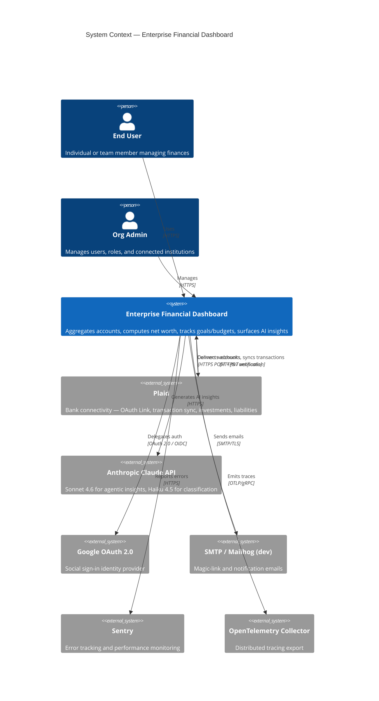
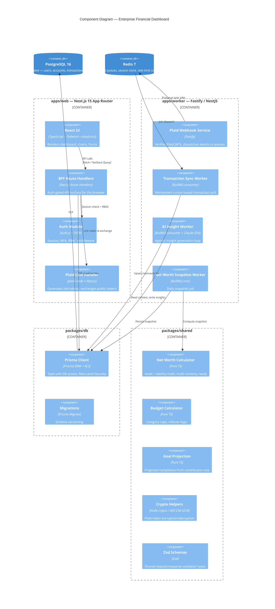
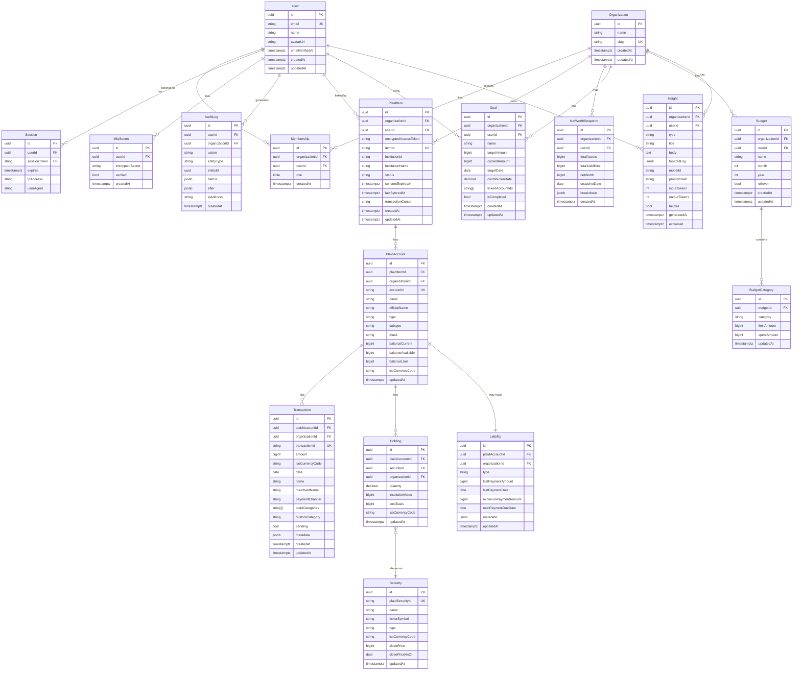
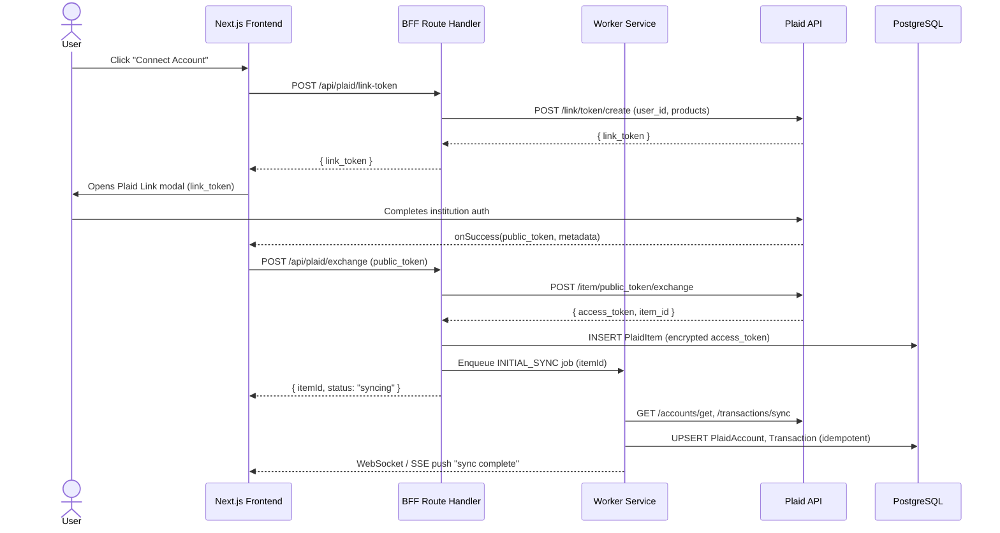
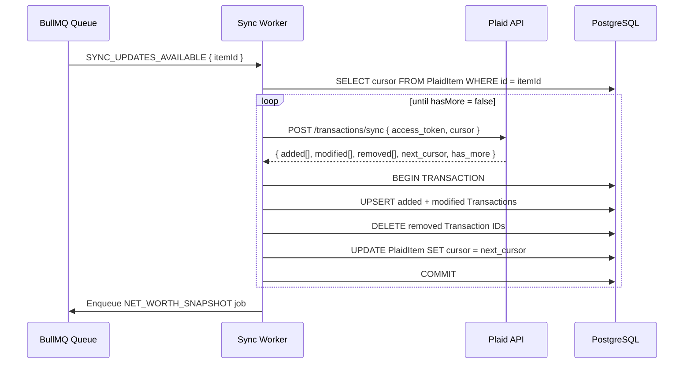
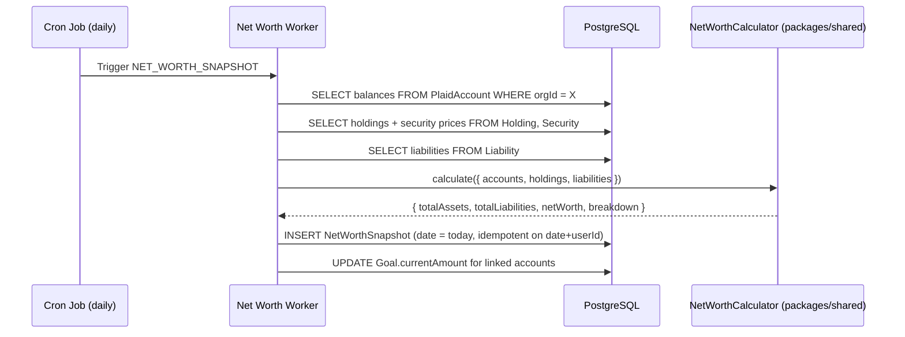
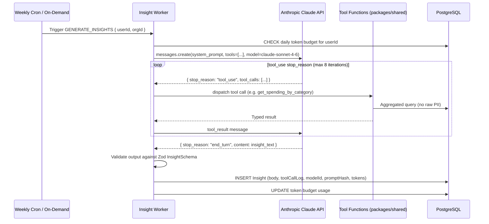

# Architecture — Enterprise Financial Dashboard

## 1. System Context Diagram

---

## 2. Component Diagram

---

## 3. Data Model ERD

---

## 4. Sequence Diagrams

### 4.1 Plaid Link Flow

### 4.2 Transaction Sync (Cursor Pattern)

### 4.3 Net Worth Calculation

### 4.4 AI Insight Generation (Agentic Loop)

---

## 5. Threat Model (STRIDE)

| # | Asset | Threat | STRIDE Category | Likelihood | Impact | Mitigation |
|---|-------|--------|-----------------|------------|--------|------------|
| T-01 | Plaid access tokens | Token exfiltration via DB breach | Information Disclosure | Medium | Critical | AES-256-GCM encryption at rest; key in env / AWS KMS; tokens never logged |
| T-02 | Session tokens | Session hijacking via XSS | Elevation of Privilege | Medium | High | HttpOnly+Secure cookies; CSP; session rotation on privilege change |
| T-03 | Auth endpoints | Credential stuffing / brute force | Denial of Service | High | Medium | Rate limiting (IP + user); TOTP MFA; account lockout after N failures |
| T-04 | Plaid webhooks | Replay attack / spoofed webhook | Spoofing | Medium | High | Verify Plaid JWT signature on every request; idempotency key deduplication |
| T-05 | AI insight endpoint | Prompt injection via merchant strings | Tampering | Low | Medium | Agent only receives aggregated/derived data, never raw merchant strings by default |
| T-06 | Multi-tenant DB | Cross-org data read | Information Disclosure | Low | Critical | Postgres Row-Level Security; every query includes org_id; RLS test suite |
| T-07 | API endpoints | CSRF on state-mutating calls | Tampering | Medium | High | SameSite=Strict cookies; CSRF token for non-GET; `next-safe` headers |
| T-08 | Env secrets | Secrets committed to git | Information Disclosure | Medium | Critical | Gitleaks in CI pre-commit; `.env` in `.gitignore`; `.env.example` documents vars |
| T-09 | Dependencies | Supply-chain compromise | Tampering | Low | High | `npm audit` + Semgrep in CI; lockfile committed; Dependabot |
| T-10 | User financial data | Insider access without audit trail | Repudiation | Low | High | AuditLog on every mutation; immutable append-only table; alerts on anomalous admin access |
| T-11 | Claude API | PII leakage to third-party model | Information Disclosure | Low | High | Tool layer returns only aggregated numbers; system prompt instructs no raw data storage |
| T-12 | Redis queue | Job poisoning / queue injection | Tampering | Low | Medium | BullMQ job data validated with Zod on dequeue; Redis requires auth; network-isolated |

---

## 6. Tech Stack Justification

| Concern | Choice | Justification |
|---------|--------|---------------|
| **Monorepo** | pnpm workspaces + Turborepo | Best-in-class caching, workspace hoisting; Turborepo remote cache for CI speed |
| **Frontend framework** | Next.js 15 App Router | RSC reduces client bundle; file-based routing; built-in API routes for BFF; Vercel-aligned but portable |
| **UI library** | shadcn/ui + Tailwind | Copy-owned components (no versioning hell); accessible primitives; Tailwind tokens for design consistency |
| **Data fetching** | TanStack Query v5 | Server-state cache, background refetch, optimistic updates; pairs well with RSC for hydration |
| **Charts** | Recharts | React-native, composable, accessible; sufficient for financial sparklines and trend charts |
| **Backend jobs** | Fastify service (apps/worker) | Lightweight, schema-first, excellent TypeScript support; keeps long-running work off Next.js edge |
| **ORM** | Prisma | Type-safe queries; migration tooling; RLS support via `$executeRaw` for policy DDL |
| **Queue** | BullMQ + Redis | Battle-tested; per-queue concurrency; delayed jobs; retry with backoff; UI (Bull Board) |
| **Auth** | Auth.js v5 | Framework-agnostic adapter; Prisma adapter; MFA extensible; avoids rolling custom sessions |
| **AI** | Anthropic Claude (Sonnet 4.6 + Haiku 4.5) | Tool use native; instruction-following for financial guardrails; cost tiering via model selection |
| **Plaid** | plaid-node v14+ | Official SDK; `/transactions/sync` cursor pattern; investment + liabilities support |
| **Money math** | BigInt minor units | Eliminates floating-point rounding errors entirely; safe across all currencies |
| **Observability** | Pino + OpenTelemetry + Sentry | Structured logs (parseable); OTEL vendor-neutral traces; Sentry for exception grouping |
| **Testing** | Vitest + Playwright + Supertest + MSW | Vitest fast with TS; Playwright for real-browser E2E; MSW intercepts at network for Plaid mocks |
| **CI** | GitHub Actions | Native secrets; matrix builds; Semgrep + Gitleaks available as marketplace actions |
| **Infra (local)** | Docker Compose | Reproducible; Postgres + Redis + Mailhog in one command; health checks prevent race conditions |
| **Infra (prod)** | Terraform stubs for AWS | ECS Fargate (stateless), RDS Multi-AZ, ElastiCache, Secrets Manager, CloudFront; Terraform documents intent without applying |
