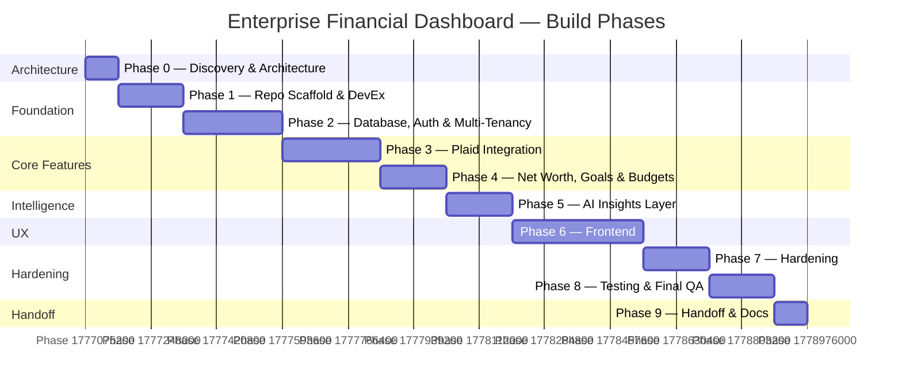

# Roadmap — Enterprise Financial Dashboard

## Overview

Nine sequential phases from architecture through handoff. Each phase has clear acceptance criteria and ships tested, production-ready code. Two mandatory human checkpoints gate the transition from design → code (Checkpoint 1) and from implementation → release (Checkpoint 2).

---

## Phase Map

---

## Phase Details

### Phase 0 — Discovery & Architecture ✅
**Goal:** Align on architecture before writing a line of code.

**Deliverables:**
- `docs/ARCHITECTURE.md` — system context, component, ERD, sequence diagrams, STRIDE threat model, stack justification
- `docs/SECURITY.md` — secret management, encryption, PII handling, RBAC matrix, audit logging
- `docs/ROADMAP.md` — this document

**Gate:** 🚦 HUMAN CHECKPOINT 1 — approval required before Phase 1 begins.

---

### Phase 1 — Repo Scaffold & DevEx
**Goal:** A clone-and-run monorepo that every developer can start in under 5 minutes.

**Deliverables:**
- pnpm workspaces + Turborepo configured
- Workspaces: `apps/web`, `apps/worker`, `packages/db`, `packages/shared`, `packages/ui`, `packages/config`
- TypeScript strict mode + `noUncheckedIndexedAccess` across all packages
- ESLint (typescript-eslint + security plugin) + Prettier + Husky + lint-staged + commitlint
- `docker-compose.yml` (Postgres 16, Redis 7, Mailhog) with health checks
- `.env.example` fully documented
- `Makefile` with: `setup`, `dev`, `test`, `test:e2e`, `lint`, `typecheck`, `db:migrate`, `db:seed`, `db:reset`
- `README.md` with prerequisites and 5-minute quickstart
- GitHub Actions: `ci.yml` (lint/typecheck/test), `security.yml` (Semgrep + npm audit + Gitleaks)

**Acceptance:** `git clone` → `make setup` → `make dev` works. CI green.

---

### Phase 2 — Database, Auth & Multi-Tenancy
**Goal:** Secure, multi-tenant foundation with verified identity and access control.

**Deliverables:**
- Full Prisma schema (all 16 entities from ERD)
- Migrations + dev seed (1 org, 3 users with different roles, fake Plaid accounts)
- Postgres Row-Level Security policies for org isolation
- Auth.js v5: email magic link + Google OAuth
- TOTP MFA enrollment and challenge flow
- `requirePermission()` RBAC middleware
- Audit log on every sensitive mutation
- RLS test suite proving cross-org reads are blocked

**Acceptance:** Auth E2E test (signup → MFA enroll → login → MFA challenge → dashboard). RLS tests pass.

---

### Phase 3 — Plaid Integration
**Goal:** Securely connect bank accounts and reliably sync financial data.

**Deliverables:**
- Plaid Link token endpoint + public token exchange with encrypted access token storage
- `/transactions/sync` cursor-based sync in BullMQ worker (idempotent)
- Plaid webhook handler with JWT signature verification
- Investments sync (`/investments/holdings/get`, `/investments/transactions/get`)
- Liabilities sync (`/liabilities/get`)
- Re-link flow for `ITEM_LOGIN_REQUIRED`
- Sandbox-only configuration; documented path to development + production

**Acceptance:** MSW-mocked integration tests (happy path, webhook replay rejection, token refresh, re-link). Manual sandbox smoke test documented.

---

### Phase 4 — Net Worth, Goals & Budgets
**Goal:** Core financial intelligence — what you have, what you owe, what you're working toward.

**Deliverables:**
- Net worth calculator: assets − liabilities, multi-currency ready (USD-only initially)
- Daily net worth snapshot job
- Goals: target amount + date, contribution rate, projected completion, linked accounts
- Budgets: monthly category caps, rollover toggle, real-time spend tracking
- Transaction categorization: Plaid baseline + user override + ML-ready interface

**Acceptance:** Property-based tests on net worth math (fast-check). Snapshot job tested with frozen clock. Budget rollover edge cases covered.

---

### Phase 5 — AI Insights Layer (Agentic)
**Goal:** Claude-powered financial analysis that surfaces actionable, safe, well-sourced insights.

**Deliverables:**
- 6 typed tool functions: `get_account_summary`, `get_spending_by_category`, `get_recurring_subscriptions`, `get_goal_progress`, `get_net_worth_trend`, `find_anomalous_transactions`
- Agentic loop: tool-use → tool_result cycle, max 8 calls, traced
- 5 insight types: spending anomaly, subscription audit, goal pacing, savings opportunity, budget breach forecast
- Weekly cron + on-demand generation
- Insight stored with full provenance (tool calls, model, prompt hash, token counts)
- PII guardrails: aggregated data only to Claude; output validated with Zod
- Hard refusals for investment advice
- Per-user daily token budget + model fallback (Haiku for classification)

**Acceptance:** Recorded fixture conversations for each insight type (no live API in CI). Schema validation tests. Refusal tests pass.

---

### Phase 6 — Frontend
**Goal:** A polished, accessible, responsive dashboard that makes financial data understandable.

**Deliverables:**
- App shell: sidebar, top bar, command palette (Cmd-K), dark mode
- Pages: Dashboard, Accounts, Net Worth, Goals, Budgets, Insights, Settings
- Loading skeletons, empty states, error boundaries with Sentry
- WCAG 2.1 AA: keyboard navigation, axe-core in CI
- Responsive: 375px → 4K

**Acceptance:** Playwright E2E (signup → connect Plaid sandbox → net worth → goal → insight). Lighthouse ≥ 90 on Performance, Accessibility, Best Practices.

---

### Phase 7 — Hardening
**Goal:** Production-ready security posture and operational runbooks.

**Deliverables:**
- Rate limiting on auth + Plaid + AI endpoints
- CSRF protection, CSP nonces, HSTS, security headers via `next-safe`
- Input validation with Zod everywhere; output serialization stripping secrets
- `docs/RUNBOOK.md`: backup/restore + incident response
- k6 load test script for the dashboard endpoint
- `npm audit` + Semgrep clean

**Acceptance:** `make security` green. Runbook reviewed.

---

### Phase 8 — Testing & Final QA
**Goal:** Confidence that the system works correctly, performs well, and is ready for human review.

**Deliverables:**
- Coverage ≥ 80% on `packages/shared` and core business logic; ≥ 60% overall
- Mutation testing on net worth + budget logic (Stryker)
- Full E2E suite green
- `docs/QA_CHECKLIST.md` with screenshots/recordings
- Performance budgets in CI (bundle size, LCP)

**Gate:** 🚦 HUMAN CHECKPOINT 2 — demo, test report, known gaps.

---

### Phase 9 — Handoff
**Goal:** Everything a new engineer needs to deploy, operate, and evolve the system.

**Deliverables:**
- `docs/DEPLOYMENT.md`: step-by-step AWS deploy (ECS Fargate + RDS + ElastiCache + Secrets Manager + CloudFront)
- `infra/` Terraform stubs (illustrative, not applied)
- `docs/PLAID_PRODUCTION.md`: sandbox → development → production migration
- `docs/COST_MODEL.md`: estimated monthly cost at 100 / 1k / 10k users
- `CHANGELOG.md` + tagged `v0.1.0` release

---

## Decision Log Index

ADRs live in `docs/decisions/`. Naming: `NNNN-short-title.md`.

| ADR | Title | Status |
|-----|-------|--------|
| 0001 | Adopt pnpm workspaces + Turborepo for monorepo | Accepted |
| 0002 | Use BigInt minor units for all monetary values | Accepted |
| 0003 | AES-256-GCM for Plaid token encryption (KMS envelope in production) | Accepted |
| 0004 | Auth.js v5 with Prisma adapter over custom session management | Accepted |
| 0005 | BullMQ + Redis for job queue over in-process scheduling | Accepted |
| 0006 | Tool-use agentic loop for AI insights over single-shot prompting | Accepted |

## Deferred Items

See `docs/DEFERRED.md` for items explicitly out of scope for v0.1.0 with rationale.
